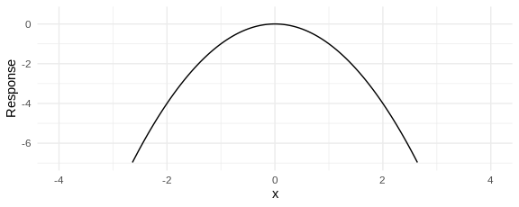
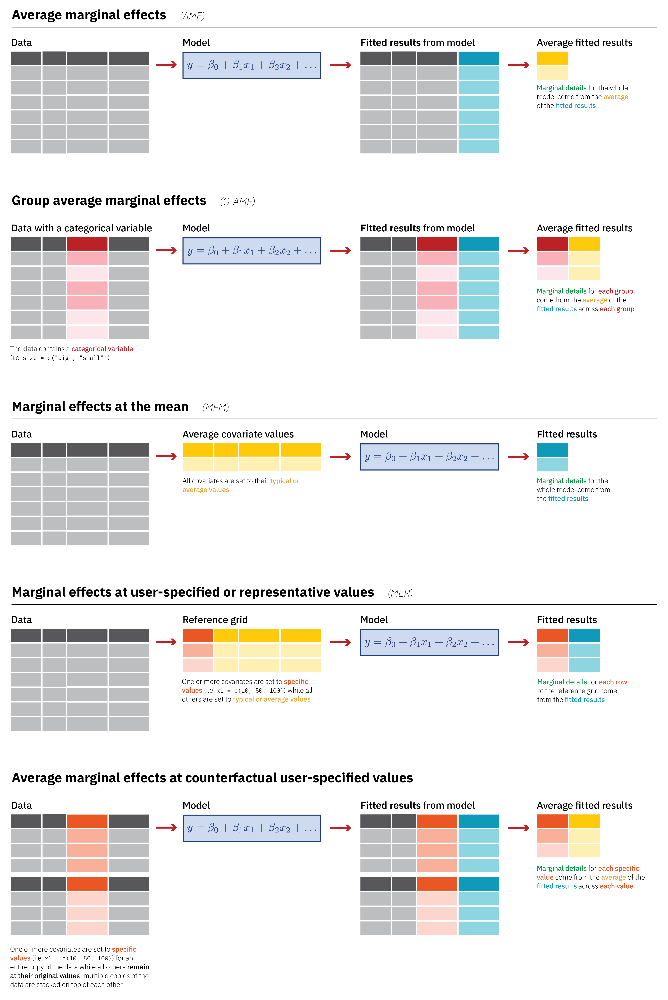
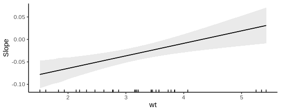
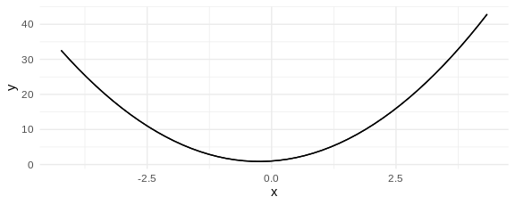
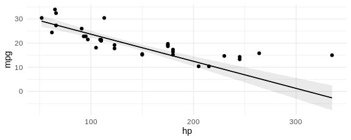
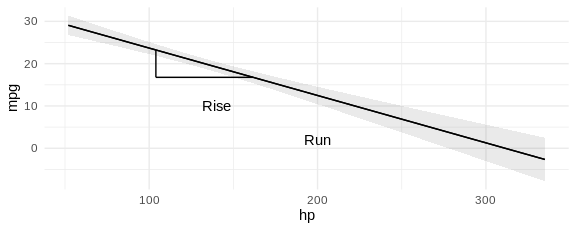
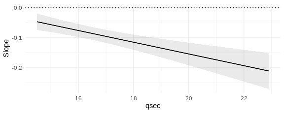
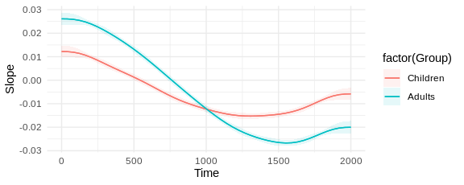

# Slopes

## Definition

Slopes are defined as:

> Partial derivatives of the regression equation with respect to a
> regressor of interest. a.k.a. Marginal effects, trends.

This vignette follows the econometrics tradition by referring to
“slopes” and “marginal effects” interchangeably. In this context, the
word “marginal” refers to the idea of a “small change,” in the calculus
sense.

A marginal effect measures the association between a change in a
regressor *x*, and a change in the response *y*. Put differently,
differently, the marginal effect is the slope of the prediction
function, measured at a specific value of the regressor *x*.

Marginal effects are extremely useful, because they are intuitive and
easy to interpret. They are often the main quantity of interest in an
empirical analysis.

In scientific practice, the “Marginal Effect” falls in the same toolbox
as the [“Contrast.”](comparisons.html) Both try to answer a
counterfactual question: What would happen to *y* if *x* were different?
They allow us to model the “effect” of a change/difference in the
regressor *x* on the response *y*.[1]

To illustrate the concept, consider this quadratic function:

*y* =  − *x*<sup>2</sup>

From the definition above, we know that the marginal effect is the
partial derivative of *y* with respect to *x*:

$$\frac{\partial y}{\partial x} = -2x$$

To get intuition about how to interpret this quantity, consider the
response of *y* to *x*. It looks like this:



When *x* increases, *y* starts to increase. But then, as *x* increases
further, *y* creeps back down in negative territory.

A marginal effect is the slope of this response function at a certain
value of *x*. The next plot adds three tangent lines, highlighting the
slopes of the response function for three values of *x*. The slopes of
these tangents tell us three things:

1.  When *x* \< 0, the slope is positive: an increase in *x* is
    associated with an increase in *y*: The marginal effect is positive.
2.  When *x* = 0, the slope is null: a (small) change in *x* is
    associated with no change in *y*. The marginal effect is null.
3.  When *x* \> 0, the slope is negative: an increase in *x* is
    associated with a decrease in *y*. The marginal effect is negative.


Below, we show how to reach the same conclusions in an estimation
context, with simulated data and the `slopes` function.

## `slopes` function

The marginal effect is a *unit-level* measure of association between
changes in a regressor and changes in the response. Except in the
simplest linear models, the value of the marginal effect will be
different from individual to individual, because it will depend on the
values of the other covariates for each individual.

The `slopes` function thus produces distinct estimates of the marginal
effect for each row of the data used to fit the model. The output of
`marginaleffects` is a simple `data.frame`, which can be inspected with
all the usual `R` commands.

To show this, we load the library, download the [Palmer
Penguins](https://allisonhorst.github.io/palmerpenguins/), and estimate
a GLM model:

``` r
library(marginaleffects)

dat <- read.csv("https://vincentarelbundock.github.io/Rdatasets/csv/palmerpenguins/penguins.csv")
dat$large_penguin <- ifelse(dat$body_mass_g > median(dat$body_mass_g, na.rm = TRUE), 1, 0)

mod <- glm(large_penguin ~ bill_length_mm + flipper_length_mm + species,
           data = dat, family = binomial)
```

``` r
mfx <- slopes(mod)
head(mfx)
#> 
#>            Term Contrast Estimate Std. Error    z Pr(>|z|)    S   2.5 % 97.5 %
#>  bill_length_mm    dY/dX   0.0176    0.00837 2.11   0.0352  4.8 0.00122 0.0340
#>  bill_length_mm    dY/dX   0.0358    0.01235 2.90   0.0037  8.1 0.01164 0.0601
#>  bill_length_mm    dY/dX   0.0844    0.02109 4.00   <0.001 14.0 0.04310 0.1258
#>  bill_length_mm    dY/dX   0.0347    0.00642 5.41   <0.001 23.9 0.02213 0.0473
#>  bill_length_mm    dY/dX   0.0509    0.01351 3.77   <0.001 12.6 0.02440 0.0774
#>  bill_length_mm    dY/dX   0.0165    0.00777 2.12   0.0337  4.9 0.00128 0.0317
#> 
#> Columns: rowid, term, contrast, estimate, std.error, statistic, p.value, s.value, conf.low, conf.high, predicted_lo, predicted_hi, predicted, large_penguin, bill_length_mm, flipper_length_mm, species 
#> Type:  response
```

## The Marginal Effects Zoo

A dataset with one marginal effect estimate per unit of observation is a
bit unwieldy and difficult to interpret. There are ways to make this
information easier to digest, by computing various quantities of
interest. [In a characteristically excellent blog
post,](https://www.andrewheiss.com/blog/2022/05/20/marginalia/)
Professor Andrew Heiss introduces many such quantities:

-   Average Marginal Effects
-   Group-Average Marginal Effects
-   Marginal Effects at User-Specified Values (or Representative Values)
-   Marginal Effects at the Mean
-   Counterfactual Marginal Effects
-   Conditional Marginal Effects

The rest of this vignette defines each of those quantities and explains
how to use the `slopes()` and `plot_slopes()` functions to compute them.
The main differences between these quantities pertain to (a) the
regressor values at which we estimate marginal effects, and (b) the way
in which unit-level marginal effects are aggregated.

Heiss drew this exceedingly helpful graph which summarizes the
information in the rest of this vignette:



### Average Marginal Effect (AME)

A dataset with one marginal effect estimate per unit of observation is a
bit unwieldy and difficult to interpret. Many analysts like to report
the “Average Marginal Effect”, that is, the average of all the
observation-specific marginal effects. These are easy to compute based
on the full `data.frame` shown above, but the `avg_slopes()` function is
convenient:

``` r
avg_slopes(mod)
#> 
#>               Term           Contrast Estimate Std. Error      z Pr(>|z|)    S    2.5 %  97.5 %
#>  bill_length_mm    dY/dX                0.0276    0.00578  4.774   <0.001 19.1  0.01625  0.0389
#>  flipper_length_mm dY/dX                0.0106    0.00235  4.511   <0.001 17.2  0.00598  0.0152
#>  species           Chinstrap - Adelie  -0.4148    0.05654 -7.336   <0.001 42.0 -0.52561 -0.3040
#>  species           Gentoo - Adelie      0.0617    0.10688  0.577    0.564  0.8 -0.14779  0.2712
#> 
#> Columns: term, contrast, estimate, std.error, statistic, p.value, s.value, conf.low, conf.high 
#> Type:  response
```

Note that since marginal effects are derivatives, they are only properly
defined for continuous numeric variables. When the model also includes
categorical regressors, the `summary` function will try to display
relevant (regression-adjusted) contrasts between different categories,
as shown above.

You can also extract average marginal effects using `tidy` and `glance`
methods which conform to the [`broom` package
specification](https://broom.tidymodels.org/):

``` r
tidy(mfx)
#> # A tibble: 4 × 8
#>   term              contrast                       estimate std.error statistic  p.value conf.low conf.high
#>   <chr>             <chr>                             <dbl>     <dbl>     <dbl>    <dbl>    <dbl>     <dbl>
#> 1 bill_length_mm    mean(dY/dX)                      0.0276   0.00578     4.77  1.81e- 6  0.0163     0.0389
#> 2 flipper_length_mm mean(dY/dX)                      0.0106   0.00235     4.51  6.45e- 6  0.00598    0.0152
#> 3 species           mean(Chinstrap) - mean(Adelie)  -0.415    0.0565     -7.34  2.20e-13 -0.526     -0.304 
#> 4 species           mean(Gentoo) - mean(Adelie)      0.0617   0.107       0.577 5.64e- 1 -0.148      0.271

glance(mfx)
#> # A tibble: 1 × 7
#>     aic   bic r2.tjur  rmse  nobs     F logLik   
#>   <dbl> <dbl>   <dbl> <dbl> <int> <dbl> <logLik> 
#> 1  180.  199.   0.695 0.276   342  15.7 -84.92257
```

### Group-Average Marginal Effect (G-AME)

We can also use the `by` argument the average marginal effects *within
different subgroups* of the observed data, based on values of the
regressors. For example, to compute the average marginal effects of Bill
Length for each Species, we do:

``` r
avg_slopes(
  mod,
  by = "species",
  variables = "bill_length_mm")
#> 
#>            Term    Contrast   species Estimate Std. Error    z Pr(>|z|)    S   2.5 %  97.5 %
#>  bill_length_mm mean(dY/dX) Adelie     0.04353    0.00878 4.96   <0.001 20.4  0.0263 0.06074
#>  bill_length_mm mean(dY/dX) Chinstrap  0.03679    0.00976 3.77   <0.001 12.6  0.0177 0.05591
#>  bill_length_mm mean(dY/dX) Gentoo     0.00287    0.00284 1.01    0.312  1.7 -0.0027 0.00845
#> 
#> Columns: term, contrast, species, estimate, std.error, statistic, p.value, s.value, conf.low, conf.high, predicted_lo, predicted_hi, predicted 
#> Type:  response
```

This is equivalent to manually taking the mean of the observation-level
marginal effect for each species sub-group:

``` r
aggregate(
  mfx$estimate,
  by = list(mfx$species, mfx$term),
  FUN = mean)
#>     Group.1           Group.2            x
#> 1    Adelie    bill_length_mm  0.043532570
#> 2 Chinstrap    bill_length_mm  0.036793674
#> 3    Gentoo    bill_length_mm  0.002872923
#> 4    Adelie flipper_length_mm  0.016708310
#> 5 Chinstrap flipper_length_mm  0.014121843
#> 6    Gentoo flipper_length_mm  0.001102661
#> 7    Adelie           species -0.054519623
#> 8 Chinstrap           species -0.313337522
#> 9    Gentoo           species -0.250726004
```

Note that `marginaleffects` follows `Stata` and the `margins` package in
computing standard errors using the group-wise averaged Jacobian.

### Marginal Effect at User-Specified Values

Sometimes, we are not interested in *all* the unit-specific marginal
effects, but would rather look at the estimated marginal effects for
certain “typical” individuals, or for user-specified values of the
regressors. The `datagrid` function helps us build a data grid full of
“typical” rows. For example, to generate artificial Adelies and Gentoos
with 180mm flippers:

``` r
datagrid(flipper_length_mm = 180,
         species = c("Adelie", "Gentoo"),
         model = mod)
#>   large_penguin bill_length_mm flipper_length_mm species
#> 1     0.4853801       43.92193               180  Adelie
#> 2     0.4853801       43.92193               180  Gentoo
```

The same command can be used (omitting the `model` argument) to
`marginaleffects`’s `newdata` argument to compute marginal effects for
those (fictional) individuals:

``` r
slopes(
  mod,
  newdata = datagrid(
    flipper_length_mm = 180,
    species = c("Adelie", "Gentoo")))
#> 
#>               Term           Contrast flipper_length_mm species Estimate Std. Error      z Pr(>|z|)    S    2.5 %   97.5 %
#>  bill_length_mm    dY/dX                            180  Adelie   0.0607    0.03322  1.827   0.0678  3.9 -0.00443  0.12578
#>  bill_length_mm    dY/dX                            180  Gentoo   0.0847    0.03925  2.157   0.0310  5.0  0.00773  0.16159
#>  flipper_length_mm dY/dX                            180  Adelie   0.0233    0.00551  4.230   <0.001 15.4  0.01250  0.03408
#>  flipper_length_mm dY/dX                            180  Gentoo   0.0325    0.00851  3.819   <0.001 12.9  0.01582  0.04917
#>  species           Chinstrap - Adelie               180  Adelie  -0.2111    0.10668 -1.978   0.0479  4.4 -0.42013 -0.00197
#>  species           Chinstrap - Adelie               180  Gentoo  -0.2111    0.10668 -1.978   0.0479  4.4 -0.42013 -0.00197
#>  species           Gentoo - Adelie                  180  Adelie   0.1591    0.30225  0.526   0.5986  0.7 -0.43328  0.75152
#>  species           Gentoo - Adelie                  180  Gentoo   0.1591    0.30225  0.526   0.5986  0.7 -0.43328  0.75152
#> 
#> Columns: rowid, term, contrast, estimate, std.error, statistic, p.value, s.value, conf.low, conf.high, flipper_length_mm, species, predicted_lo, predicted_hi, predicted, large_penguin, bill_length_mm 
#> Type:  response
```

When variables are omitted from the `datagrid` call, they will
automatically be set at their mean or mode (depending on variable type).

### Marginal Effect at the Mean (MEM)

The “Marginal Effect at the Mean” is a marginal effect calculated for a
hypothetical observation where each regressor is set at its mean or
mode. By default, the `datagrid` function that we used in the previous
section sets all regressors to their means or modes. To calculate the
MEM, we can set the `newdata` argument, which determines the values of
predictors at which we want to compute marginal effects:

``` r
slopes(mod, newdata = "mean")
#> 
#>               Term           Contrast Estimate Std. Error       z Pr(>|z|)    S    2.5 %  97.5 %
#>  bill_length_mm    dY/dX                0.0503    0.01244   4.038   <0.001 14.2  0.02586  0.0746
#>  flipper_length_mm dY/dX                0.0193    0.00553   3.489   <0.001 11.0  0.00845  0.0301
#>  species           Chinstrap - Adelie  -0.8070    0.07690 -10.494   <0.001 83.2 -0.95776 -0.6563
#>  species           Gentoo - Adelie      0.0829    0.11469   0.722     0.47  1.1 -0.14193  0.3076
#> 
#> Columns: rowid, term, contrast, estimate, std.error, statistic, p.value, s.value, conf.low, conf.high, predicted_lo, predicted_hi, predicted, large_penguin, bill_length_mm, flipper_length_mm, species 
#> Type:  response
```

### Counterfactual Marginal Effects

The `datagrid` function allowed us look at completely fictional
individuals. Setting the `grid_type` argument of this function to
`"counterfactual"` lets us compute the marginal effects for the actual
observations in our dataset, but with a few manipulated values. For
example, this code will create a `data.frame` twice as long as the
original `dat`, where each observation is repeated with different values
of the `flipper_length_mm` variable:

``` r
nd <- datagrid(flipper_length_mm = c(160, 180),
               model = mod,
               grid_type = "counterfactual")
```

We see that the rows 1, 2, and 3 of the original dataset have been
replicated twice, with different values of the `flipper_length_mm`
variable:

``` r
nd[nd$rowid %in% 1:3,]
#>     rowidcf large_penguin bill_length_mm species flipper_length_mm
#> 1         1             0           39.1  Adelie               160
#> 2         2             0           39.5  Adelie               160
#> 3         3             0           40.3  Adelie               160
#> 343       1             0           39.1  Adelie               180
#> 344       2             0           39.5  Adelie               180
#> 345       3             0           40.3  Adelie               180
```

We can use the observation-level marginal effects to compute average (or
median, or anything else) marginal effects over the counterfactual
individuals:

``` r
library(dplyr)

slopes(mod, newdata = nd) |>
    group_by(term) |>
    summarize(estimate = median(estimate))
#> # A tibble: 3 × 2
#>   term               estimate
#>   <chr>                 <dbl>
#> 1 bill_length_mm    0.00985  
#> 2 flipper_length_mm 0.00378  
#> 3 species           0.0000226
```

### Conditional Marginal Effects (Plot)

The `plot_slopes` function can be used to draw “Conditional Marginal
Effects.” This is useful when a model includes interaction terms and we
want to plot how the marginal effect of a variable changes as the value
of a “condition” (or “moderator”) variable changes:

``` r
mod <- lm(mpg ~ hp * wt + drat, data = mtcars)

plot_slopes(mod, variables = "hp", condition = "wt")
```


The marginal effects in the plot above were computed with values of all
regressors – except the `variables` and the `condition` – held at their
means or modes, depending on variable type.

Since `plot_slopes()` produces a `ggplot2` object, it is easy to
customize. For example:

``` r
plot_slopes(mod, variables = "hp", condition = "wt") +
    geom_rug(aes(x = wt), data = mtcars) +
    theme_classic()
```



## Example: Quadratic

In the “Definition” section of this vignette, we considered how marginal
effects can be computed analytically in a simple quadratic equation
context. We can now use the `slopes` function to replicate our analysis
of the quadratic function in a regression application.

Say you estimate a linear regression model with a quadratic term:

*Y* = *β*<sub>0</sub> + *β*<sub>1</sub>*X*<sup>2</sup> + *ε*

and obtain estimates of *β*<sub>0</sub> = 1 and *β*<sub>1</sub> = 2.
Taking the partial derivative with respect to *X* and plugging in our
estimates gives us the marginal effect of *X* on *Y*:

∂*Y*/∂*X* = *β*<sub>0</sub> + 2 ⋅ *β*<sub>1</sub>*X*
∂*Y*/∂*X* = 1 + 4*X*

This result suggests that the effect of a *change* in *X* on *Y* depends
on the *level* of *X*. When *X* is large and positive, an increase in
*X* is associated to a large increase in *Y*. When *X* is small and
positive, an increase in *X* is associated to a small increase in *Y*.
When *X* is a large negative value, an increase in *X* is associated
with a *decrease* in *Y*.

`marginaleffects` arrives at the same conclusion in simulated data:

``` r
library(tidyverse)
N <- 1e5
quad <- data.frame(x = rnorm(N))
quad$y <- 1 + 1 * quad$x + 2 * quad$x^2 + rnorm(N)
mod <- lm(y ~ x + I(x^2), quad)

slopes(mod, newdata = datagrid(x = -2:2))  |>
    mutate(truth = 1 + 4 * x) |>
    select(estimate, truth)
#> 
#>  Estimate
#>     -7.01
#>     -3.00
#>      1.00
#>      5.01
#>      9.01
#> 
#> Columns: estimate, truth
```

We can plot conditional adjusted predictions with `plot_predictions`
function:

``` r
plot_predictions(mod, condition = "x")
```



We can plot conditional marginal effects with the `plot_slopes` function
(see section below):

``` r
plot_slopes(mod, variables = "x", condition = "x")
```


Again, the conclusion is the same. When *x* \< 0, an increase in *x* is
associated with an decrease in *y*. When *x* \> 1/4, the marginal effect
is positive, which suggests that an increase in *x* is associated with
an increase in *y*.

## Slopes vs Predictions: A Visual Interpretation

Often, analysts will plot predicted values of the outcome with a best
fit line:

``` r
library(ggplot2)

mod <- lm(mpg ~ hp * qsec, data = mtcars)

plot_predictions(mod, condition = "hp", vcov = TRUE) +
  geom_point(data = mtcars, aes(hp, mpg)) 
```



The slope of this line is calculated using the same technique we all
learned in grade school: dividing rise over run.

``` r
p <- plot_predictions(mod, condition = "hp", vcov = TRUE, draw = FALSE)
plot_predictions(mod, condition = "hp", vcov = TRUE) +
  geom_segment(aes(x = p$hp[10], xend = p$hp[10], y = p$estimate[10], yend = p$estimate[20])) +
  geom_segment(aes(x = p$hp[10], xend = p$hp[20], y = p$estimate[20], yend = p$estimate[20])) +
  annotate("text", label = "Rise", y = 10, x = 140) +
  annotate("text", label = "Run", y = 2, x = 200)
```



Instead of computing this slope manually, we can just call:

``` r
avg_slopes(mod, variables = "hp")
#> 
#>  Term Estimate Std. Error     z Pr(>|z|)    S  2.5 %  97.5 %
#>    hp   -0.112     0.0126 -8.92   <0.001 61.0 -0.137 -0.0874
#> 
#> Columns: term, estimate, std.error, statistic, p.value, s.value, conf.low, conf.high 
#> Type:  response
```

Now, consider the fact that our model includes an interaction between
`hp` and `qsec`. This means that the slope will actually differ based on
the value of the moderator variable `qsec`:

``` r
plot_predictions(mod, condition = list("hp", "qsec" = "quartile"))
```


We can estimate the slopes of these three fit lines easily:

``` r
slopes(
  mod,
  variables = "hp",
  newdata = datagrid(qsec = quantile(mtcars$qsec, probs = c(.25, .5, .75))))
#> 
#>  Term qsec Estimate Std. Error     z Pr(>|z|)    S  2.5 %  97.5 %
#>    hp 16.9  -0.0934     0.0111 -8.43   <0.001 54.6 -0.115 -0.0717
#>    hp 17.7  -0.1093     0.0123 -8.92   <0.001 60.9 -0.133 -0.0853
#>    hp 18.9  -0.1325     0.0154 -8.61   <0.001 56.9 -0.163 -0.1023
#> 
#> Columns: rowid, term, estimate, std.error, statistic, p.value, s.value, conf.low, conf.high, qsec, predicted_lo, predicted_hi, predicted, mpg, hp 
#> Type:  response
```

As we see in the graph, all three slopes are negative, but the Q3 slope
is steepest.

We could then push this one step further, and measure the slope of `mpg`
with respect to `hp`, *for all observed values* of `qsec`. This is
achieved with the `plot_slopes()` function:

``` r
plot_slopes(mod, variables = "hp", condition = "qsec") +
  geom_hline(yintercept = 0, linetype = 3)
```



This plot shows that the marginal effect of `hp` on `mpg` is always
negative (the slope is always below zero), and that this effect becomes
even more negative as `qsec` increases.

## Prediction types

The `marginaleffect` function takes the derivative of the fitted (or
predicted) values of the model, as is typically generated by the
`predict(model)` function. By default, `predict` produces predictions on
the `"response"` scale, so the marginal effects should be interpreted on
that scale. However, users can pass a string or a vector of strings to
the `type` argument, and `marginaleffects` will consider different
outcomes.

Typical values include `"response"` and `"link"`, but users should refer
to the documentation of the `predict` of the package they used to fit
the model to know what values are allowable. documentation.

``` r
mod <- glm(am ~ mpg, family = binomial, data = mtcars)
avg_slopes(mod, type = "response")
#> 
#>  Term Estimate Std. Error    z Pr(>|z|)    S  2.5 % 97.5 %
#>   mpg   0.0465    0.00887 5.24   <0.001 22.6 0.0291 0.0639
#> 
#> Columns: term, estimate, std.error, statistic, p.value, s.value, conf.low, conf.high 
#> Type:  response

avg_slopes(mod, type = "link")
#> 
#>  Term Estimate Std. Error    z Pr(>|z|)   S  2.5 % 97.5 %
#>   mpg    0.307      0.115 2.67  0.00751 7.1 0.0819  0.532
#> 
#> Columns: term, estimate, std.error, statistic, p.value, s.value, conf.low, conf.high 
#> Type:  link
```

## Minimum or maximum slope (velocity)

In some fields such as epidemiology, it is common to compute the minimum
or maximum slope, as a measure of the “velocity” of the response
function. To achieve this, we can use the `comparisons()` function and
define custom functions. Here, we present a quick example without much
detail, but you can refer to [the comparisons
vignette](comparisons.html) for more explanations on custom functions in
the `comparison` argument.

Consider this simple GAM model:

``` r
library(marginaleffects)
library(itsadug)
library(mgcv)

simdat$Subject <- as.factor(simdat$Subject)
model <- bam(Y ~ Group + s(Time, by = Group) + s(Subject, bs = "re"),
             data = simdat)

plot_slopes(model, variables = "Time", condition = c("Time", "Group"))
```



Minimum velocity, overall:

``` r
comparisons(model,
  variables = list("Time" = 1e-6),
  vcov = FALSE,
  comparison = \(hi, lo) min((hi - lo) / 1e-6))
#> 
#>  Term Contrast Estimate
#>  Time   +1e-06  -0.0267
#> 
#> Columns: term, contrast, estimate, predicted_lo, predicted_hi, predicted 
#> Type:  response
```

Minimum velocity by group:

``` r
comparisons(model,
  variables = list("Time" = 1e-6),
  by = "Group",
  vcov = FALSE,
  comparison = \(hi, lo) min((hi - lo) / 1e-6))
#> 
#>  Term Contrast    Group Estimate
#>  Time   +1e-06 Children  -0.0153
#>  Time   +1e-06 Adults    -0.0267
#> 
#> Columns: term, contrast, Group, estimate 
#> Type:  response
```

Difference between the minimum velocity of each group:

``` r
comparisons(model,
  variables = list("Time" = 1e-6),
  vcov = FALSE,
  by = "Group",
  hypothesis = "pairwise",
  comparison = \(hi, lo) min((hi - lo) / 1e-6))
#> 
#>               Term Estimate
#>  Children - Adults   0.0114
#> 
#> Columns: term, estimate 
#> Type:  response
```

What `Time` value corresponds to the minimum velocity?

``` r
low = function(hi, lo, x) {
    dydx <- (hi - lo) / 1e-6
    dydx_min <- min(dydx)
    x[dydx == dydx_min][1]
}

comparisons(model,
  variables = list("Time" = 1e-6),
  vcov = FALSE,
  by = "Group",
  comparison = low)
#> 
#>  Term Contrast    Group Estimate
#>  Time   +1e-06 Children     1313
#>  Time   +1e-06 Adults       1556
#> 
#> Columns: term, contrast, Group, estimate 
#> Type:  response
```

## Manual computation

Now we illustrate how to reproduce the output of `slopes` manually:

``` r
library(marginaleffects)

mod <- glm(am ~ hp, family = binomial, data = mtcars)

eps <- 1e-4
d1 <- transform(mtcars, hp = hp - eps / 2)
d2 <- transform(mtcars, hp = hp + eps / 2)
p1 <- predict(mod, type = "response", newdata = d1)
p2 <- predict(mod, type = "response", newdata = d2)
s <- (p2 - p1) / eps
tail(s)
#>  Porsche 914-2   Lotus Europa Ford Pantera L   Ferrari Dino  Maserati Bora     Volvo 142E 
#>  -0.0020285496  -0.0020192814  -0.0013143243  -0.0018326764  -0.0008900012  -0.0020233577
```

Which is equivalent to:

``` r
slopes(mod, eps = eps) |> tail()
#> 
#>  Term Estimate Std. Error     z Pr(>|z|)   S    2.5 %    97.5 %
#>    hp -0.00203   0.001347 -1.51  0.13199 2.9 -0.00467  0.000611
#>    hp -0.00202   0.001556 -1.30  0.19440 2.4 -0.00507  0.001031
#>    hp -0.00131   0.000441 -2.98  0.00285 8.5 -0.00218 -0.000451
#>    hp -0.00183   0.001323 -1.39  0.16591 2.6 -0.00443  0.000760
#>    hp -0.00089   0.000283 -3.14  0.00169 9.2 -0.00145 -0.000334
#>    hp -0.00202   0.001586 -1.28  0.20206 2.3 -0.00513  0.001085
#> 
#> Columns: rowid, term, estimate, std.error, statistic, p.value, s.value, conf.low, conf.high, predicted_lo, predicted_hi, predicted, am, hp 
#> Type:  response
```

And we can get average marginal effects by subgroup as follows:

``` r
tapply(s, mtcars$cyl, mean)
#>            4            6            8 
#> -0.002010526 -0.001990774 -0.001632681

slopes(mod, eps = eps, by = "cyl")
#> 
#>  Term    Contrast cyl Estimate Std. Error     z Pr(>|z|)   S    2.5 %   97.5 %
#>    hp mean(dY/dX)   4 -0.00201    0.00141 -1.43   0.1540 2.7 -0.00478 0.000754
#>    hp mean(dY/dX)   6 -0.00199    0.00150 -1.33   0.1833 2.4 -0.00492 0.000941
#>    hp mean(dY/dX)   8 -0.00163    0.00095 -1.72   0.0858 3.5 -0.00350 0.000230
#> 
#> Columns: term, contrast, cyl, estimate, std.error, statistic, p.value, s.value, conf.low, conf.high, predicted_lo, predicted_hi, predicted 
#> Type:  response
```

[1] The term “effect” is itself tricky. To be clear, this vignette does
*not* use the word “effect” to imply “causality”.
